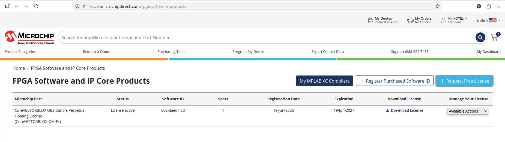
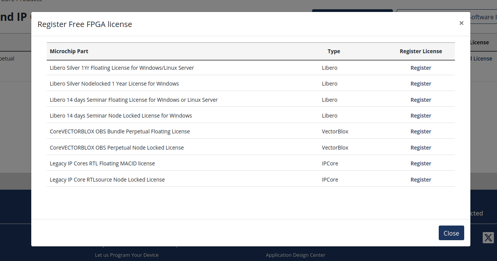

# Toolchain Setup

## Development Machine

| Component | Version / Details |
|------------|-------------------|
| Operating System | Ubuntu 22.04.5 LTS |
| Architecture | x86_64 |
| Python | 3.10.12 |
| Git | 2.34.1 |

---

## FPGA Development Tools

| Tool | Version / Details |
|------|-------------------|
| Libero SoC | Libero SoC Design Suite v2025.1 |
| Simulator | ModelSim ME Pro / QuestaSim ME |
| Synthesis Tool | Synplify Pro ME |
| License | 1-Year Silver Floating License |

The simulation and synthesis tools listed above are installed as part of the Libero SoC Design Suite.

For Libero SoC installation and licensing instructions, refer to the official Microchip Developer Help documentation:

- https://developerhelp.microchip.com/xwiki/bin/view/software-tools/fpga-design-tools/libero-installation/

---

## Target Hardware

| Component | Details |
|----------|---------|
| Development Board | BeagleV-Fire |
| FPGA Device | Microchip PolarFire SoC MPFS025T-FCVG484 |

---

## License Acquisition

The development environment uses a **1-Year Silver Floating License** for Libero SoC. This license enables FPGA design, simulation, synthesis, and implementation for supported PolarFire SoC devices.

The Silver Floating License can be requested from the official Microchip FPGA Licensing Portal:

- https://www.microchipdirect.com/fpga-software-products

**Figure 1.** Microchip FPGA Software and IP Core Products portal.



**Figure 2.** Requesting a free FPGA software license through the Microchip licensing portal.



---

## Known Setup Issues

Libero SoC uses a FlexNet license server to manage software licenses. If the license daemon is not running, Libero cannot acquire a valid license and reports a licensing error during startup. Therefore, the license server must be started before launching Libero SoC.

### Step 1: Navigate to the License Daemons directory
```bash
cd ~/microchip/Libero_SoC_2025.1/LicenseDaemons
```

### Step 2: Start the FlexNet license manager
```bash
./lmgrd -c ~/Downloads/combined_license.dat -l ~/Downloads/license.log
```
This command starts the license manager using the combined license file and creates a log file for monitoring license activity.

### Step 3: Verify that the license daemons are running
```bash
ps -ef | grep lmgrd
```
The following processes should be visible:

- `lmgrd`
- `actlmgrd`
- `saltd`
- `snpslmd`

The presence of these processes confirms that the license server has started successfully.

### Step 4: Launch Libero SoC
```bash
~/microchip/Libero_SoC_2025.1/Libero_SoC/Designer/bin64/libero
```
Once the license server is active, Libero SoC launches normally and is ready for FPGA design, synthesis, and implementation.

> **Note:** The license daemon must be running before every Libero SoC session unless it has already been started in the current system session.
